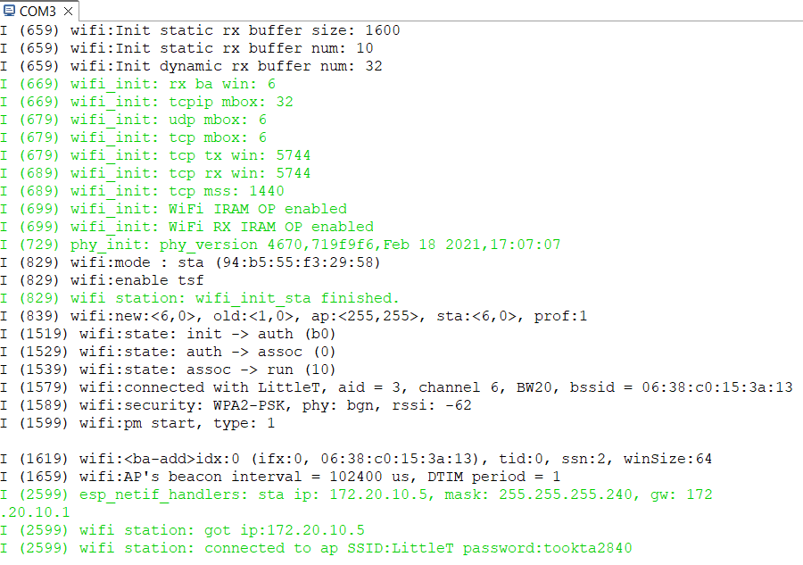

# ใบงานการทดลอง ESP32_ESP-IDF_WiFi-STA

## ขั้นตอนการทดลอง


1. สร้าง Espressif IDF project ใหม่ ชื่อ  ESP32_ESP-IDF_WiFi-STA 

2. แก้ไขไฟล์ main.c ให้เป็นดังนี้

## ไฟล์ main.c
```c
/* WiFi station Example

   This example code is in the Public Domain (or CC0 licensed, at your option.)

   Unless required by applicable law or agreed to in writing, this
   software is distributed on an "AS IS" BASIS, WITHOUT WARRANTIES OR
   CONDITIONS OF ANY KIND, either express or implied.
*/
#include <string.h>
#include "freertos/FreeRTOS.h"
#include "freertos/task.h"
#include "freertos/event_groups.h"
#include "esp_system.h"
#include "esp_wifi.h"
#include "esp_event.h"
#include "esp_log.h"
#include "nvs_flash.h"

#include "lwip/err.h"
#include "lwip/sys.h"

/* The examples use WiFi configuration that you can set via project configuration menu

   If you'd rather not, just change the below entries to strings with
   the config you want - ie #define EXAMPLE_WIFI_SSID "mywifissid"
*/

#define EXAMPLE_ESP_WIFI_SSID      "_____Wifi_SSID___"
#define EXAMPLE_ESP_WIFI_PASS      "___Wifi_password_"
#define EXAMPLE_ESP_MAXIMUM_RETRY  5

/* FreeRTOS event group to signal when we are connected*/
static EventGroupHandle_t s_wifi_event_group;

/* The event group allows multiple bits for each event, but we only care about two events:
 * - we are connected to the AP with an IP
 * - we failed to connect after the maximum amount of retries */
#define WIFI_CONNECTED_BIT BIT0
#define WIFI_FAIL_BIT      BIT1

static const char *TAG = "wifi station";

static int s_retry_num = 0;

static void event_handler(void* arg, esp_event_base_t event_base,
                                int32_t event_id, void* event_data)
{
    if (event_base == WIFI_EVENT && event_id == WIFI_EVENT_STA_START) {
        esp_wifi_connect();
    } else if (event_base == WIFI_EVENT && event_id == WIFI_EVENT_STA_DISCONNECTED) {
        if (s_retry_num < EXAMPLE_ESP_MAXIMUM_RETRY) {
            esp_wifi_connect();
            s_retry_num++;
            ESP_LOGI(TAG, "retry to connect to the AP");
        } else {
            xEventGroupSetBits(s_wifi_event_group, WIFI_FAIL_BIT);
        }
        ESP_LOGI(TAG,"connect to the AP fail");
    } else if (event_base == IP_EVENT && event_id == IP_EVENT_STA_GOT_IP) {
        ip_event_got_ip_t* event = (ip_event_got_ip_t*) event_data;
        ESP_LOGI(TAG, "got ip:" IPSTR, IP2STR(&event->ip_info.ip));
        s_retry_num = 0;
        xEventGroupSetBits(s_wifi_event_group, WIFI_CONNECTED_BIT);
    }
}

void wifi_init_sta(void)
{
    s_wifi_event_group = xEventGroupCreate();

    ESP_ERROR_CHECK(esp_netif_init());

    ESP_ERROR_CHECK(esp_event_loop_create_default());
    esp_netif_create_default_wifi_sta();

    wifi_init_config_t cfg = WIFI_INIT_CONFIG_DEFAULT();
    ESP_ERROR_CHECK(esp_wifi_init(&cfg));

    esp_event_handler_instance_t instance_any_id;
    esp_event_handler_instance_t instance_got_ip;
    ESP_ERROR_CHECK(esp_event_handler_instance_register(WIFI_EVENT,
                                                        ESP_EVENT_ANY_ID,
                                                        &event_handler,
                                                        NULL,
                                                        &instance_any_id));
    ESP_ERROR_CHECK(esp_event_handler_instance_register(IP_EVENT,
                                                        IP_EVENT_STA_GOT_IP,
                                                        &event_handler,
                                                        NULL,
                                                        &instance_got_ip));

    wifi_config_t wifi_config = {
        .sta = {
            .ssid = EXAMPLE_ESP_WIFI_SSID,
            .password = EXAMPLE_ESP_WIFI_PASS,
            /* Setting a password implies station will connect to all security modes including WEP/WPA.
             * However these modes are deprecated and not advisable to be used. Incase your Access point
             * doesn't support WPA2, these mode can be enabled by commenting below line */
	     .threshold.authmode = WIFI_AUTH_WPA2_PSK,
        },
    };
    ESP_ERROR_CHECK(esp_wifi_set_mode(WIFI_MODE_STA) );
    ESP_ERROR_CHECK(esp_wifi_set_config(WIFI_IF_STA, &wifi_config) );
    ESP_ERROR_CHECK(esp_wifi_start() );

    ESP_LOGI(TAG, "wifi_init_sta finished.");

    /* Waiting until either the connection is established (WIFI_CONNECTED_BIT) or connection failed for the maximum
     * number of re-tries (WIFI_FAIL_BIT). The bits are set by event_handler() (see above) */
    EventBits_t bits = xEventGroupWaitBits(s_wifi_event_group,
            WIFI_CONNECTED_BIT | WIFI_FAIL_BIT,
            pdFALSE,
            pdFALSE,
            portMAX_DELAY);

    /* xEventGroupWaitBits() returns the bits before the call returned, hence we can test which event actually
     * happened. */
    if (bits & WIFI_CONNECTED_BIT) {
        ESP_LOGI(TAG, "connected to ap SSID:%s password:%s",
                 EXAMPLE_ESP_WIFI_SSID, EXAMPLE_ESP_WIFI_PASS);
    } else if (bits & WIFI_FAIL_BIT) {
        ESP_LOGI(TAG, "Failed to connect to SSID:%s, password:%s",
                 EXAMPLE_ESP_WIFI_SSID, EXAMPLE_ESP_WIFI_PASS);
    } else {
        ESP_LOGE(TAG, "UNEXPECTED EVENT");
    }

    /* The event will not be processed after unregister */
    ESP_ERROR_CHECK(esp_event_handler_instance_unregister(IP_EVENT, IP_EVENT_STA_GOT_IP, instance_got_ip));
    ESP_ERROR_CHECK(esp_event_handler_instance_unregister(WIFI_EVENT, ESP_EVENT_ANY_ID, instance_any_id));
    vEventGroupDelete(s_wifi_event_group);
}

void app_main(void)
{
    //Initialize NVS
    esp_err_t ret = nvs_flash_init();
    if (ret == ESP_ERR_NVS_NO_FREE_PAGES || ret == ESP_ERR_NVS_NEW_VERSION_FOUND) {
      ESP_ERROR_CHECK(nvs_flash_erase());
      ret = nvs_flash_init();
    }
    ESP_ERROR_CHECK(ret);

    ESP_LOGI(TAG, "ESP_WIFI_MODE_STA");
    wifi_init_sta();
}

```


3. แก้ไขบรรทัดต่อไปนี้ ให้เป็น SSID และ Password ของ Access point ที่ใช้

```c
#define EXAMPLE_ESP_WIFI_SSID      "_____Wifi_SSID___"
#define EXAMPLE_ESP_WIFI_PASS      "___Wifi_password_"

```


## Link Repository
https://github.com/CHOTIKA040/ESP32_ESP-IDF_WiFi-STA_